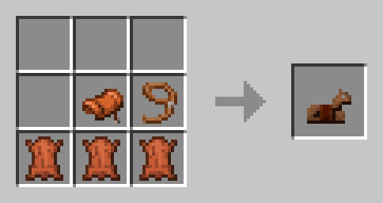
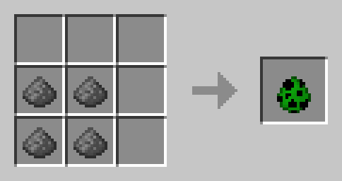

# Recipe Builder API

Spigot's APIs to create Recipes are kinda woerd sometimes, and can be confusing for beginners.
Therefore, MXPaper provides some simple Builder DSLs to create shaped and shapeless recipes.

### Example Use of the Shaped recipe builder

```kotlin

val letherHorseArmor = shapedRecipe {
    
    result = ItemStack(Material.LEATHER_HORSE_ARMOR)
    key = pluginkey("leather_horse_armor_recipe")
    
    shape {
        row(1, ' ', ' ', ' ')
        row(2, ' ', 's', 'l')
        row(3, '#', '#', '#')
        
        materials (
            ' ' to Material.AIR,
            's' to Material.SADDLE,
            'l' to Material.LEAD,
            '#' to Material.LEATHER
        )
    }
}
```

### This creates the following recipe


### Example of the Shapeless recipe builder

```kotlin
val creeperSpawnEgg = shapelessRecipe {
    result = ItemStack(Material.CREEPER_SPAWN_EGG)
    key = pluginkey("creeper_spawn_egg_recipe")
    
    ingredient(4, Material.GUN_POWDER)
}
```
### This creates the following recipe


_or any other arangement of 4 gunpowder3_

